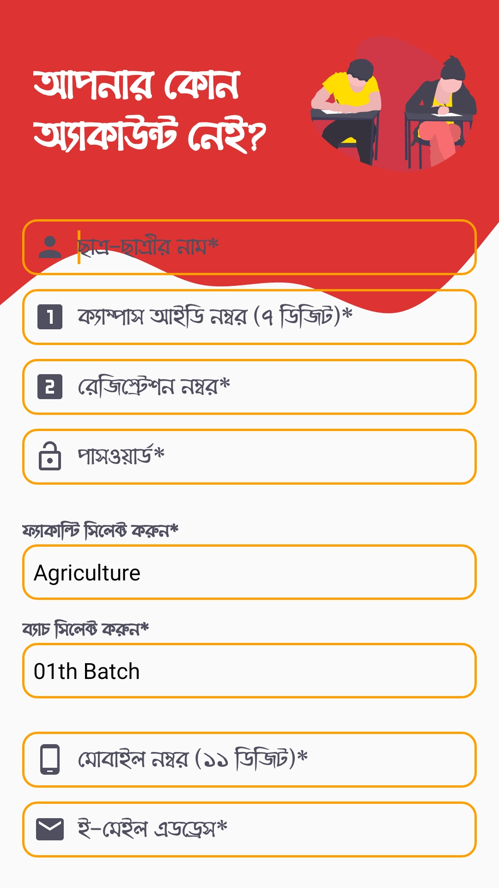
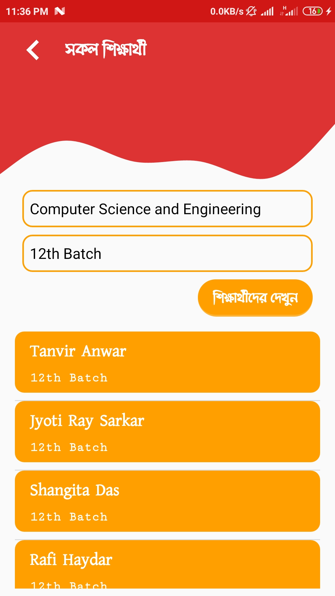
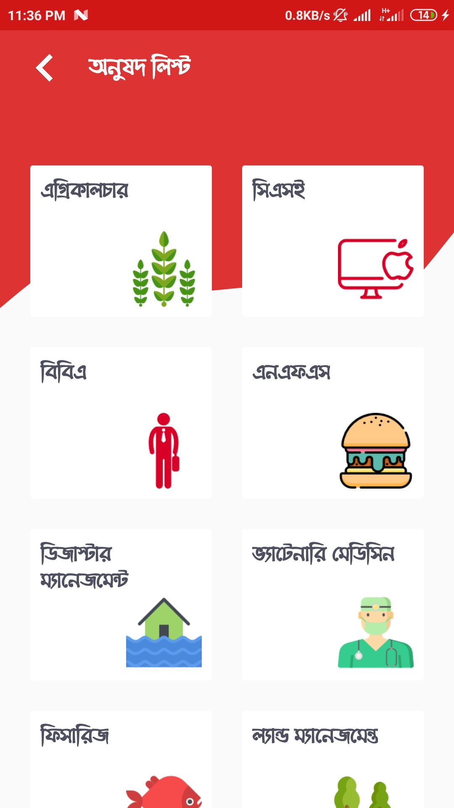
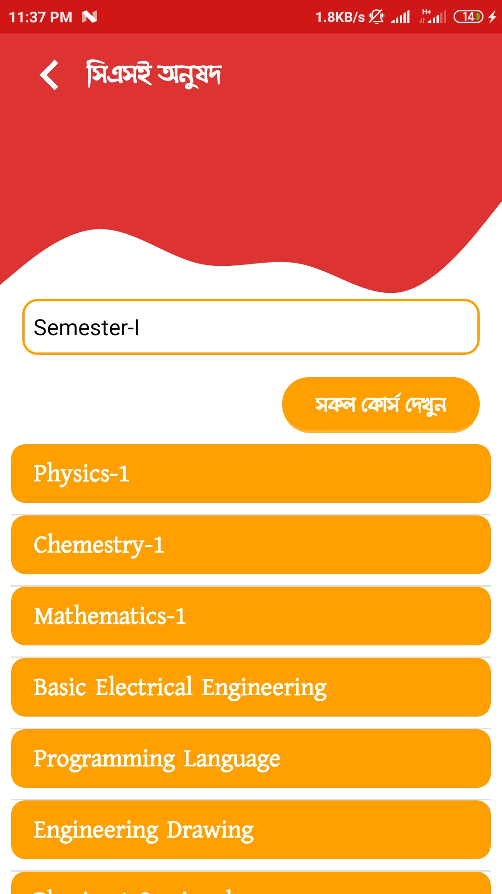
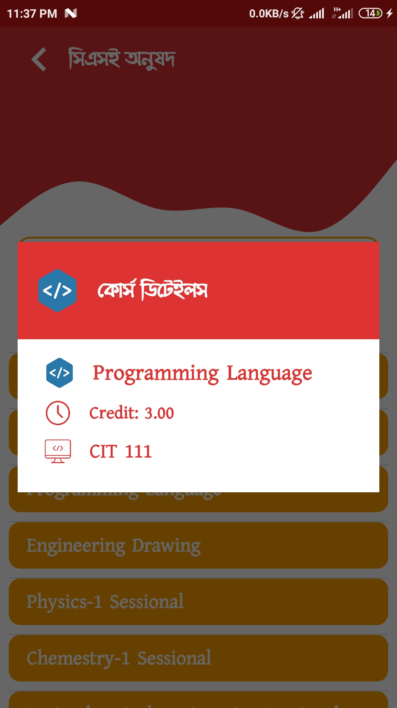

# PSTU Profile App

PSTU Profile এ্যাপটি পটুয়াখালি বিজ্ঞান ও প্রযুক্তি বিশ্ববিদ্যালয় রিপ্রেজেন্ট করে। PSTU Profile এ্যাপটিতে পবিপ্রবি ক্যাম্পাসের সকল শিক্ষক, ছাত্র-ছাত্রী এবং সকল কোর্স অনলাইন ডাটাবেস এ অন্তর্ভুক্ত রয়েছে। এই এ্যাপের মাধ্যমে সকল ছাত্র-ছাত্রী এবং সকল শিক্ষকবৃন্দ তাদের প্রোফাইল তৈরি করতে পারবে। প্রয়োজনে প্রোফাইল আপডেট অরতে পারবে। কোন শিক্ষার্থী খুব সহজেই যে কোন সেমিস্টারের কোর্স সমূহ দেখে নিতে পারবে। ক্যাম্পাসের ভিসির সাথে এপয়েন্টমেন্ট এর জন্য প্রয়োজনীয় ডিটেলস পাওয়া যাবে। PSTU Profile এ্যাপটির সাহায্যে খুব সহজেই কোনও শিক্ষার্থী বা শিক্ষককে খুঁজে পাওয়া যাবে এবং তাদের সাথে ফোন কল, এসএমএস এবং ইমেল ফিচারের মাধ্যমে যোগাযোগ করা যাবে।

### Features:
•	শিক্ষক প্রোফাইল
•	শিক্ষার্থী প্রোফাইল
•	ফোন কল
•	এসএমএস সেন্ডিং
•	ই-মেইল সেন্ডিং
•	শিক্ষক/শিক্ষার্থী সার্চিং 

### Permissions:
 - INTERNET
 - ACCESS_NETWORK_STATE
 
## Screenshots
 &nbsp;&nbsp; &nbsp;&nbsp; &nbsp;&nbsp; &nbsp;&nbsp; &nbsp;&nbsp; &nbsp;&nbsp; &nbsp;&nbsp; &nbsp;&nbsp; &nbsp;&nbsp; &nbsp;&nbsp; &nbsp;&nbsp; &nbsp;&nbsp; &nbsp;&nbsp;
 
